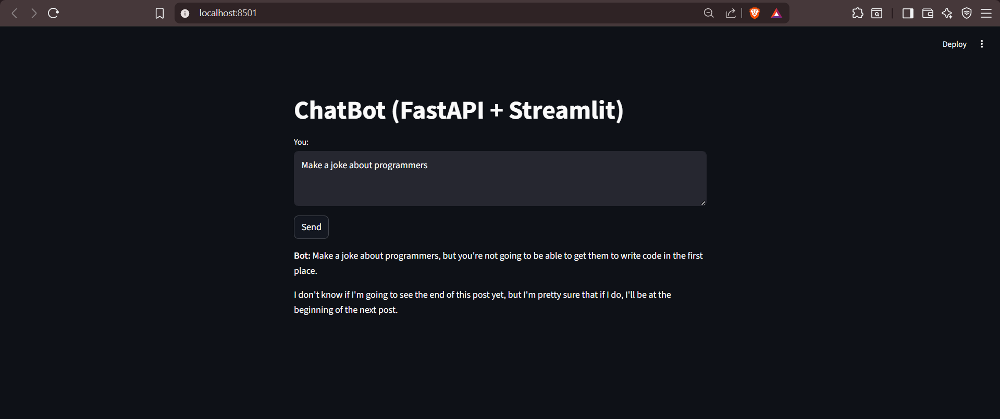
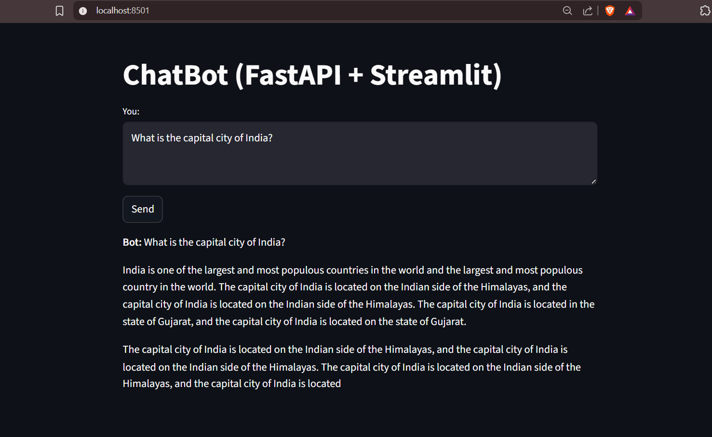
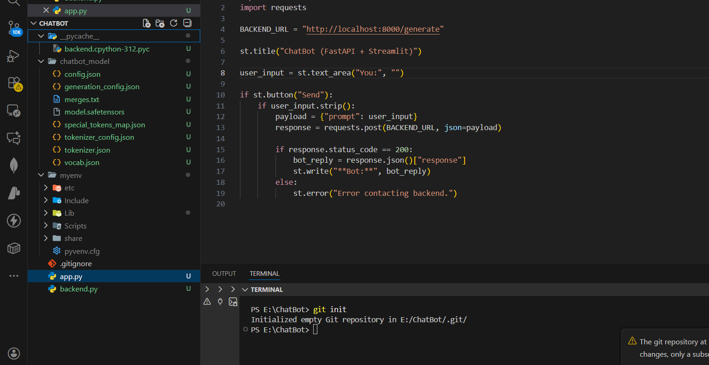
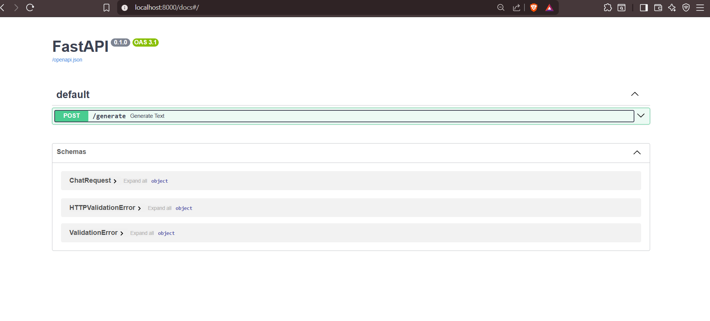

<div align="center">

# 🤖 ChatBot — FastAPI + Streamlit + GPT Model  
A lightweight AI chatbot powered by a fine-tuned GPT model, wrapped with a FastAPI backend and a clean Streamlit UI.


</div>

---

## 🌟 Features

- ⚡ **FastAPI backend** serving your fine-tuned GPT model  
- 🎨 **Minimal, beautiful Streamlit UI**  
- 🧠 **Custom GPT-based text generation** (trained on  dataset from kaggle )  
- 🔄 **JSON API for easy integration**  
- 🚀 **Local, private, fast — no external APIs needed**  
- 🗂️ Organized project structure  


---

## 🧰 Tech Stack

| Layer | Technology |
|-------|------------|
| **Frontend** | Streamlit |
| **Backend** | FastAPI + Uvicorn |
| **ML Model** | HuggingFace GPT-2 fine-tuned |
| **Language** | Python |
| **Environment** | Virtualenv |
| **Version Control** | Git + GitHub |

---

## 📂 Project Structure

ChatBot/
│
├── backend.py 
├── app.py 
├── chatbot_model
├── myenv
├── images_github
├── .gitignore


---

## 🖼️ Screenshots


### 📌 App UI











---

## 🛠️ Installation

### 1️⃣ Clone the repository

```bash
git clone https://github.com/Prensu/ChatBot.git
cd ChatBot
